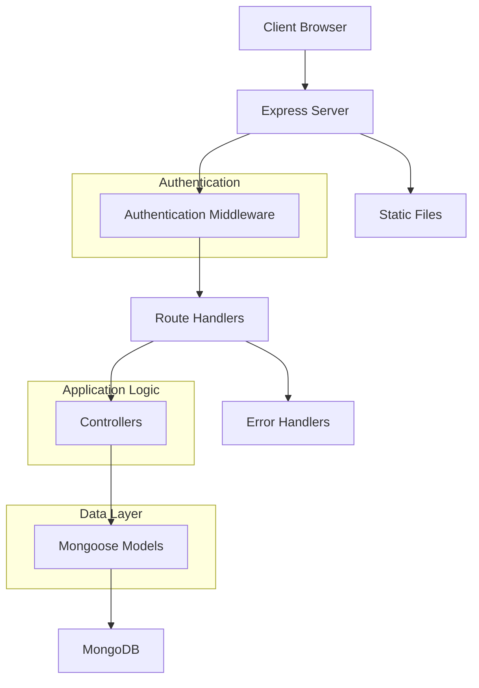

# SplitUp - Expense Splitting Application

[](https://opensource.org/licenses/ISC)

SplitUp is a modern web application that helps friends and groups manage shared expenses efficiently. Whether you're splitting bills, tracking group expenses, or managing shared costs, SplitUp makes it easy to keep track of who owes what and who's paid what.

## 🚀 Features

- **User Authentication**

  - Secure signup and login system
  - JWT-based authentication
  - Profile management

- **Group Management**

  - Create and manage expense groups
  - Add multiple participants
  - Assign admin roles
  - Track group expenses

- **Expense Tracking**

  - Create detailed expense records
  - Split expenses among participants
  - Track payments and pending amounts
  - Generate expense summaries

- **Real-time Updates**
  - Automatic balance calculations
  - Real-time expense tracking
  - Instant notifications

## 📱 Tech Stack

- **Backend**: Node.js with Express
- **Database**: MongoDB with Mongoose
- **Authentication**: JWT with Cookie-based session management
- **Security**: bcrypt for password hashing

## 📋 Architecture



## 🛠️ Installation

1. Clone the repository

```bash
git clone https://github.com/yourusername/splitup.git
```

2. Install dependencies

```bash
cd splitup
npm install
```

3. Set up environment variables
   Create a `.env` file with the following variables:

```
MONGODB_URI=your_mongodb_uri
JWT_SECRET=your_jwt_secret
PORT=3000
```

4. Start the development server

```bash
npm run dev
```

## 📝 API Documentation

Detailed API documentation is available in [API_LIST.md](API_LIST.md)

## 🔒 Security Features

- Password hashing using bcrypt
- JWT-based authentication
- Cookie-based session management
- CORS protection
- Rate limiting
- Input validation

## 🤝 Contributing

1. Fork the repository
2. Create your feature branch (`git checkout -b feature/AmazingFeature`)
3. Commit your changes (`git commit -m 'Add some AmazingFeature'`)
4. Push to the branch (`git push origin feature/AmazingFeature`)
5. Open a Pull Request

## 📄 License

This project is licensed under the ISC License - see the [LICENSE](LICENSE) file for details.

## 🙏 Acknowledgments

- Special thanks to the Node.js and Express.js communities
- Thanks for using SplitUp! 🚀
